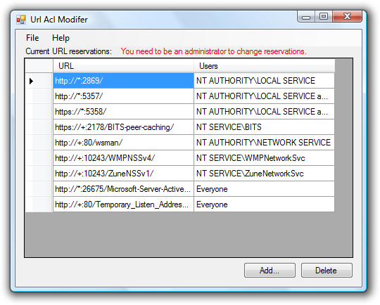

# Project Description

A library and GUI for modifying URL reservations in HTTP.SYS.  URL reservations are required to use the .NET Framework class System.Net.HttpListener as a limited user.

# Screen Shots

# Know Issue

Will not prompt for privilege elevation in Windows Vista.  
To add or remove reservations while UAC is running, right-click on the EXE and select `Run as administrator`.

# Requirements

* Windows XP SP2, Windows Server 2003, Windows Vista, or Windows Server 2008
* .NET Framework 2.0
* Should work on both x86 and x64.
* Administrator permisions to add or remove reservations.
